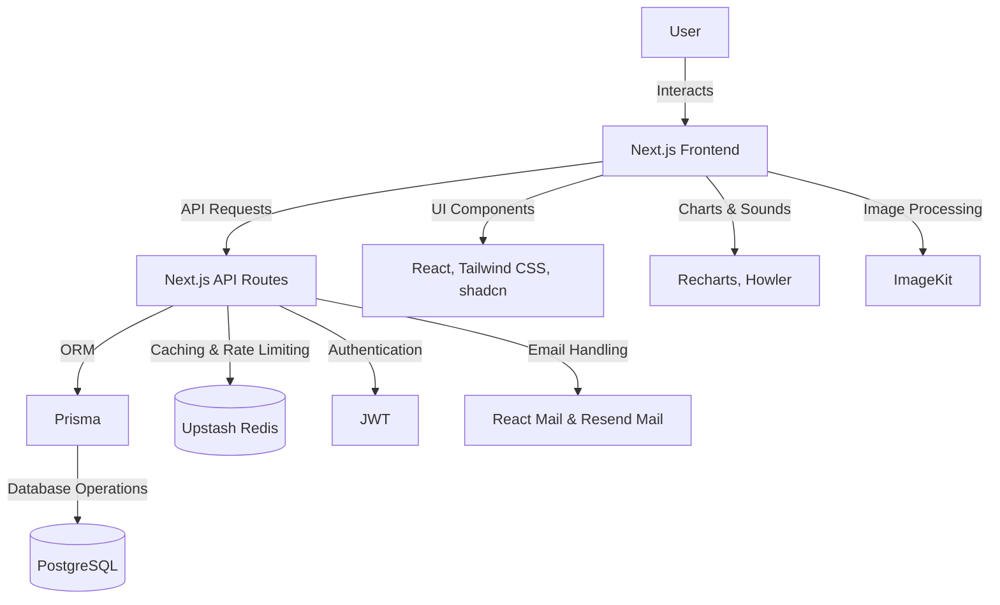

# VelociType: Speed Typing Analytics Platform 🦖⌨️

_VelociType is a Next.js-based speed typing analytics platform that lets users test, track, and improve their typing skills. With timed challenges (15-second and 60-second tests), users can measure their words per minute (WPM), track their progress, and compete on global leaderboards. The platform offers detailed user profiles with comprehensive statistics and historical performance charts._

[](https://nextjs.org/)
[](https://www.typescriptlang.org/)
[](https://turbo.build/)

## 🚀 Features

1. **Typing Challenges**

   - **Speed Run (15s):**
     - Quick test designed for immediate feedback.
   - **Marathon (60s):**
     - Longer test capturing endurance and sustained typing performance.

2. **User Analytics**

   - **Profile Dashboard:**
     - Total tests completed (15s/60s)
     - Lifetime characters and words typed
     - Accuracy percentage
     - WPM progression chart (displaying results from the last 0 to 100 tests)
     - Additional info such as user ID, profile photo, name, date joined, and leaderboard rank

3. **Competitive System**

   - Real-time leaderboards
   - Global ranking and personal best tracking

4. **Profile Management**
   - Users can update, delete, or reset their profiles through a dedicated settings page.

## ⚙️ Tech Stack Architecture

### Frontend & UI

- **Next.js:** Server-side rendering and React-based frontend.
- **TurboRepo:** Monorepo structure for efficient project management.
- **TypeScript:** Provides type safety across the entire codebase.
- **React, Tailwind CSS, shadcn:** Rapid and responsive UI development.
- **Redux Toolkit:** Manages application state.
- **React Icons:** Provides a rich set of icons.
- **Recharts & Howler:** For performance charts and sound effects respectively.

### Backend & Data Management

- **Prisma & PostgreSQL:** ORM and database management.
- **JWT:** Secure authentication.
- **Zod:** Schema validation (maintained as a separate package).
- **Upstash (Redis):** Rate limiting and caching for leaderboard data.
- **Cloudflare Turnstile:** CAPTCHA security to protect against bots.
- **End-to-End Encryption:** Uses an inbuilt crypto module and HMAC for securing requests.

### Additional Integrations

- **React Mail & Resend Mail:** Handle password reset tokens and email notifications.
- **ImageKit:** Manages image hosting and optimization.
- **Usedebaounce:** Checks the availability of email/username during profile updates.
- **Axios:** Facilitates HTTP requests.
- **Husky:** Ensures consistent code quality through Git hooks.



# Website Core

## Test Duration

- **15-second Test:** Total time in minutes = 15 / 60 = 0.25 minutes.
- **60-second Test:** Total time in minutes = 60 / 60 = 1 minute.

Choose the duration that suits you best!

## Raw WPM Calculation

**Formula:**

$$
\text{Raw WPM} = \frac{\text{Total Letters Typed} / 5}{\text{Total Time (in minutes)}}
$$

**Explanation:**

- **Total Letters Typed:** The number of characters you have entered.
- **Division by 5:** Normalizes the letter count, assuming an average word length of 5.
- **Total Time (in minutes):** For a 15-second test, this value is 0.25 minutes; for a 60-second test, it is 1 minute.

## Real WPM Calculation

**Formula:**

$$
\text{Real WPM} = \frac{\text{Total Letters Typed} / 5}{\text{Total Time (in minutes)}} - \frac{\text{Total Errors}}{\text{Total Time (in minutes)}}
$$

**Explanation:**

- The first term calculates the raw WPM.
- The second term subtracts the error rate (errors per minute), providing an adjusted WPM that reflects both speed and accuracy.

## Accuracy Calculation

$$
\text{Accuracy} = \max\left(0, \frac{\text{Total} - \text{Errors}}{\text{Total}} \times 100\right)
$$

**Explanation:**

- **Total**: Total characters typed.
- **Errors**: Number of mistakes made.
- The formula calculates the percentage of correctly typed characters, ensuring the accuracy never falls below 0%.

## Bot Detection Feature

This feature detects potential bot activity by analyzing the timing of keystrokes.

### Formulas

**Average Interval:**

$$
\text{Average Interval} = \frac{\sum_{i=1}^{n} \text{interval}_i}{n}
$$

**Variance:**

$$
\text{Variance} = \frac{\sum_{i=1}^{n} (\text{interval}_i - \text{Average Interval})^2}{n}
$$

If the variance is below a predefined threshold and the average interval is very short, the input is flagged as potentially automated.

## 🛠️ Local Setup (Critical Path)

### Prerequisites

- Node.js v18+
- PostgreSQL 16+
- Redis (or an Upstash account)
- ImageKit account (for handling media assets)

### Step-by-Step Instructions

1. **Clone the Repository**

   Open your terminal and run:

   ```bash
   git clone https://github.com/SyedFaizan8/velocitype.git
   cd velocitype
   ```

2. **Install Dependencies**

   Since the project is organized as a TurboRepo monorepo, install all dependencies from the root:

   ```bash
   npm install
   ```

   Then, navigate to the web application directory and install its dependencies:

   ```bash
   cd apps/velocity && npm install
   ```

3. **Configure Environment Variables**

   Copy the example environment file and update it with your local configuration:

   ```bash
   cp .env.example .env
   cp .env.local.example .env.local
   # Fill API keys
   ```

4. **Database Setup**

   Generate the Prisma client and push your schema to the PostgreSQL database:

   ```bash
   npx prisma generate
   npx prisma db push
   ```

5. **Start the Development Server**

   ```bash
   npm run dev
   ```

   This will start both the Next.js frontend and API routes. You should be able to access the application at http://localhost:3000.

6. **Verify Installation**
   - Open your browser and visit http://localhost:3000.
   - Create a test account.
   - Run a typing test (either the 15-second or 60-second challenge) and observe the statistics update.
   - Check that the leaderboard, profile dashboard, and performance charts are rendering correctly.
   - Test email functionalities (e.g., password reset) to ensure proper integration.

### Troubleshooting Common Issues

- **Database Connection Failures:**
  - Ensure your PostgreSQL server is running.
  - Verify that the credentials in your .env file are correct.
- **Redis Errors:**
  - Confirm that Redis is running locally or check your Upstash configuration.
- **Captcha Failures:**
  - Make sure your Cloudflare Turnstile keys in .env match your account details.

## 📬 Contact

For any inquiries or feedback, please reach out to me at [contact@syedfaizan.in](mailto:contact@syedfaizan.in)

## 📜 License

[MIT License](LICENSE)
