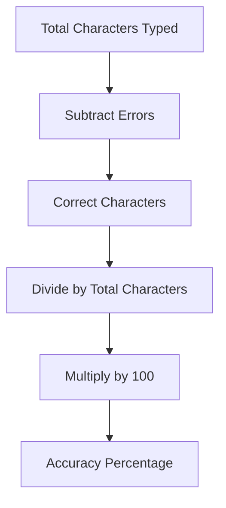

# Website Core

## Test Duration

- **15-second Test:** Total time in minutes = 15 / 60 = 0.25 minutes.
- **60-second Test:** Total time in minutes = 60 / 60 = 1 minute.

Choose the duration that suits you best!

---

## Raw WPM Calculation

**Formula:**

$$
\text{Raw WPM} = \frac{\text{Total Letters Typed} / 5}{\text{Total Time (in minutes)}}
$$

**Explanation:**

- **Total Letters Typed:** The number of characters you have entered.
- **Division by 5:** Normalizes the letter count, assuming an average word length of 5.
- **Total Time (in minutes):** For a 15-second test, this value is 0.25 minutes; for a 60-second test, it is 1 minute.

---

## Real WPM Calculation

**Formula:**

$$
\text{Real WPM} = \frac{\text{Total Letters Typed} / 5}{\text{Total Time (in minutes)}} - \frac{\text{Total Errors}}{\text{Total Time (in minutes)}}
$$

**Explanation:**

- The first term calculates the raw WPM.
- The second term subtracts the error rate (errors per minute), providing an adjusted WPM that reflects both speed and accuracy.

## Accuracy Calculation

We compute your typing accuracy using the following JavaScript snippet:

```javascript
const corrects = total - errors;
return Math.max(0, (corrects / total) * 100);
```

**Explanation:**

- **Total**: Total characters typed.
- **Errors**: Number of mistakes made.
- **Corrects**: The count of correct characters (total - errors).
- The formula calculates the percentage of correctly typed characters, ensuring the accuracy never falls below 0%.

# Diagrams

### WPM Calculation Diagram

```mermaid
flowchart TD
    A[Total Letters Typed] --> B[Divide by 5]
    B --> C[Raw Words Count]
    C --> D[Divide by Total Time (min)]
    D --> E[Raw WPM]

    F[Total Errors] --> G[Divide by Total Time (min)]
    G --> H[Errors per Minute]

    E --> I[Subtract Errors per Minute]
    I --> J[Real WPM]
```

### Accuracy Calculation Diagram


